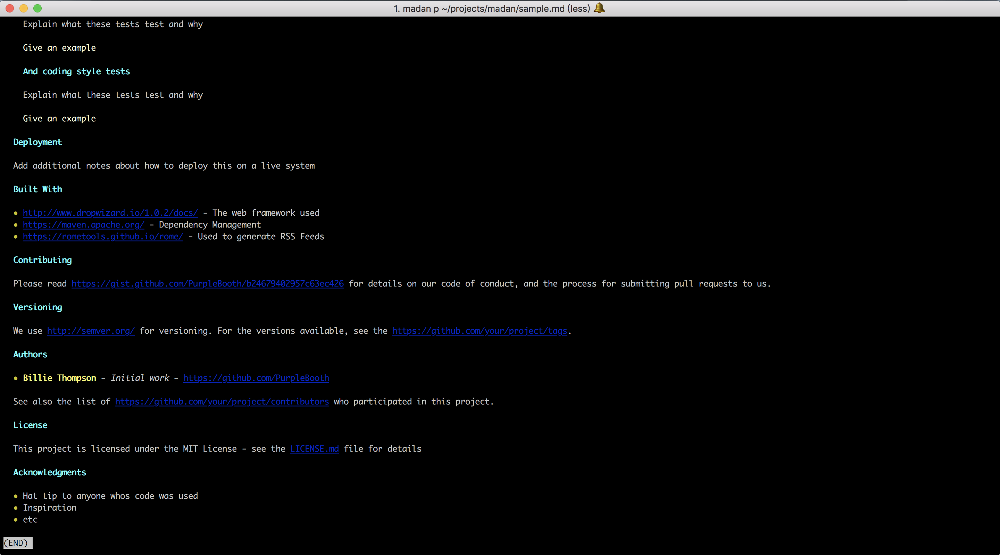

# Madan

Preview markdown file in terminal. Thanks to [@piotrmurach](https://github.com/piotrmurach/tty-markdown)'s great work. 

## Usage

```
madan p sample.md
```
This is what will it look like in terminal. 



## Installation 

**Make sure you already have gem and bundler installed**

```
curl https://raw.githubusercontent.com/gaotongfei/madan/master/install.sh | sh
```


## License

MIT
